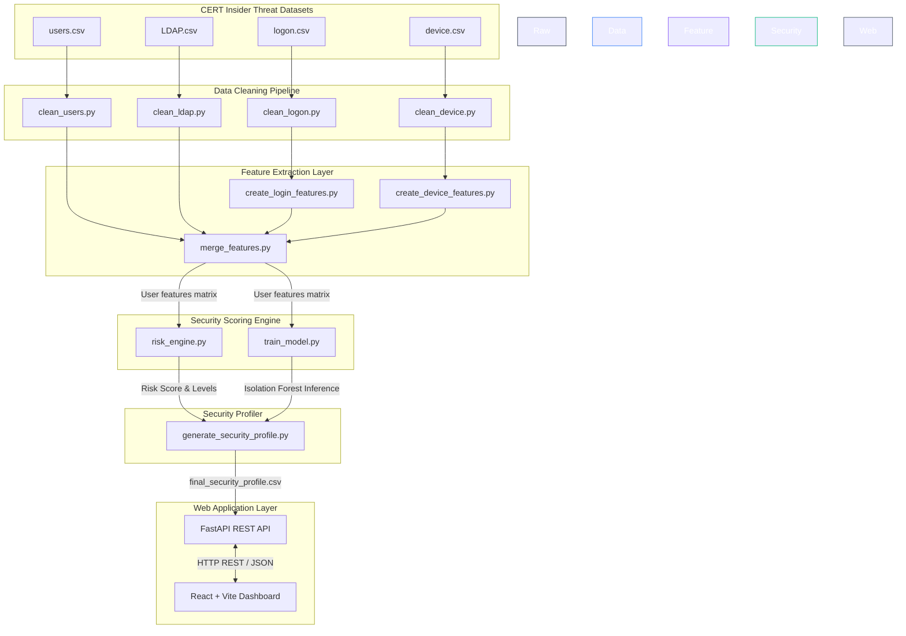
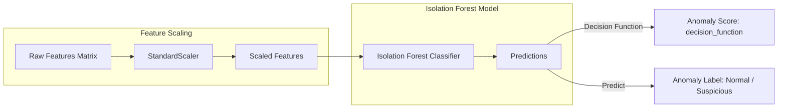

# Software Architecture Specification — User Anomaly Detection System (UADS)

This document describes the architectural layout, pipeline processing flow, security rules engine, and system integration patterns for the User Anomaly Detection System (UADS) deployed at the Nuclear Fuel Complex (NFC).

---

## 1. High-Level Architectural Flow

The system operates on an offline-to-online hybrid architecture. Data preparation, feature extraction, and machine learning model training occur offline, generating a static **Security Profile** dataset. This profile is loaded into the **FastAPI Security Gateway** on startup and served dynamically to the **React Command Center** frontend for interactive analysis, alert auditing, and executive reporting.

---

## 2. Ingestion & Preprocessing Pipeline
The raw log CSVs are parsed to enforce standard data types, normalize timestamp formats, and handle missing values:
1. **`clean_users.py`**: Reads `users.csv`, strips trailing whitespaces from employee codes, standardizes names, and retains active employees.
2. **`clean_ldap.py`**: Tracks role and department shifts over the reporting timeframe. If an employee transfers, the most active assignment is selected.
3. **`clean_logon.py`**: Standardizes ISO 8601 timestamps and maps logon activities to workstations.
4. **`clean_device.py`**: Identifies USB insertion/removal sequences, stripping outliers and erroneous log events.

---

## 3. Feature Engineering & Matrix Construction
To train the machine learning algorithm, user-level behavioral metrics are constructed:

$$X_{user} = [f_1, f_2, f_3, \dots, f_{11}]$$

Where the feature vector contains:
* **Logon Behavior**:
  * `total_logins`: Cumulative logins across the monitored duration.
  * `active_days`: Days the employee logged into at least one computer.
  * `avg_logins_per_day`: Ratio of `total_logins` to `active_days`.
  * `unique_pcs_used`: Number of distinct physical computers accessed.
  * `after_hours_logins`: Logons recorded between 18:00 (6 PM) and 06:00 (6 AM).
  * `weekend_logins`: Logons recorded on Saturday or Sunday.
  * `after_hours_ratio`: Ratio of after-hours logins to total logins.
  * `weekend_ratio`: Ratio of weekend logins to total logins.
* **Removable Storage Device Usage**:
  * `usb_connects`: Cumulative USB storage drive mounts.
  * `after_hours_usb`: USB mounts recorded outside standard business hours.
  * `login_device_ratio`: Ratio of logons to USB mounts (a very low ratio signifies heavy data-copying relative to system usage).

---

## 4. Threat Risk Scoring Engine (`risk_rules.py` & `risk_engine.py`)
A mathematical rules engine computes a numerical risk score ($S_{risk}$) for each user using normalized, weighted sub-metrics.

$$S_{risk} = \sum (SubScore_i \times W_i)$$

### Weights Configuration ($W_i$)
The weights are configured based on threat severity levels:
* **After Hours Logins ($W = 0.20$)**: Evaluates system accesses during typical non-work periods.
* **After Hours USB Connects ($W = 0.20$)**: High indicator of stealthy data staging.
* **Logins-to-Device Ratio ($W = 0.15$)**: Highlights users with high peripheral activity relative to active system time.
* **Unique Workstations Used ($W = 0.15$)**: Detects suspicious physical moving/workstation hops.
* **Weekend Logins ($W = 0.15$)**: Access during weekend maintenance windows.
* **USB Total Connects ($W = 0.15$)**: Cumulative volume indicator of external storage activity.

### Scoring Functions
Each sub-score is normalized to a $[0.0, 100.0]$ range. For instance:
* **Unique Workstations**:
  * $1 \text{ PC} \rightarrow 0$ points
  * $2 \text{ PCs} \rightarrow 50$ points
  * $\ge 3 \text{ PCs} \rightarrow 100$ points
* **Linear Metric Scaling**: 
  $$\text{SubScore} = \min\left(\frac{\text{Feature Count}}{\text{Threshold}_{\max}}, 1.0\right) \times 100$$
* **Risk Categorization**:
  * $0 - 25 \rightarrow$ **Low**
  * $26 - 50 \rightarrow$ **Medium**
  * $51 - 75 \rightarrow$ **High**
  * $76 - 100 \rightarrow$ **Critical**

---

## 5. Isolation Forest Anomaly Detection

* **Standardization**: Features are normalized using `StandardScaler` to have a mean of 0 and a variance of 1, preventing high-frequency count features (like total logins) from overwhelming ratio metrics.
* **Isolation Forest Classifier**: 
  * Isolation Forest builds an ensemble of $100$ Isolation Trees ($n\_estimators=100$). Because anomalies have distinct values, they require fewer random splits to isolate in tree paths.
  * **Contamination Rate ($5\%$)**: The decision boundary is calibrated to flag the top $5\%$ highly-isolated data points as anomalies.
  * **Outputs**:
    * **Anomaly Score**: A continuous decision score indicating outlier intensity. Higher values indicate normal behavior, while negative values indicate anomalous behaviour.
    * **Anomaly Label**: Binary classification mapped to `Normal` (inliers) and `Suspicious` (outliers).

---

## 6. Threat Classification Matrix
The final security status is consolidated by merging the rule-based risk levels and the machine learning anomaly predictions. This prevents false positives by ensuring a user is only flagged as a threat if both pipelines identify elevated risk indicators.

| Risk Level | Anomaly Label | Final Security Status | Action Level |
| :--- | :--- | :--- | :--- |
| **Critical** | Suspicious | `Critical Threat` | Immediate Account Lockout & Audit |
| **High** | Suspicious | `High Threat` | Escalate to Security Officer for review |
| **Medium** | Suspicious | `Medium Threat` | Flag account for continuous observation |
| **Low** | Suspicious | `Normal` | Log anomaly but do not escalate |
| **Any** | Normal | `Normal` | Safe baseline |

---

## 7. Web Application Layer

* **FastAPI Backend Services**:
  * Loads `final_security_profile.csv` into memory on startup (via FastAPI `lifespan` context manager).
  * Exposes RESTful endpoints for users lookup, analytics charts data, alerts management, and CSV/PDF report building.
  * PDF generation integrates structured typography and tables matching corporate nuclear installation layouts.
* **React Command Center UI**:
  * Single Page Application architecture communicating with the backend via Axios.
  * Built-in responsiveness using Tailwind CSS grids.
  * Charts configured using Recharts to display interactive distributions and daily logon/device spikes over 500+ days.
