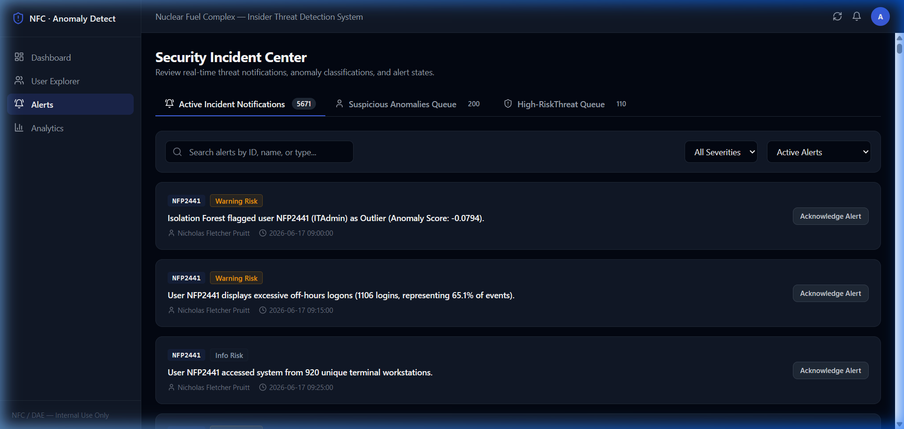

# Result Screenshot Guide — System Security Alerts

This document describes the screenshot that should be placed here to demonstrate the real-time security alerts management and resolution interface.

---

## 1. Screenshot Placeholder

> **Screenshot Filename**: `presentation/screenshots/alerts.png`
> Insert the screenshot below:
> 

---

## 2. Key Components Demonstrated in this Screenshot

1. **Alert Action Center Table**:
   * Lists generated security incidents, detailing:
     * **Alert ID / Timestamp**: Event generation logs.
     * **Employee Code**: Target user ID.
     * **Severity Badge**: color-coded levels (`Critical` - Red, `High` - Orange, `Warning` - Yellow, `Info` - Grey).
     * **Alert Description**: Concise summary of what triggered the rule (e.g., "Out of hours USB insertion and logins on multiple terminals").
     * **Status Badge**: Current status of investigation (`Pending`, `Investigating`, `Resolved`, `Dismissed`).

2. **Incident Filtering Controls**:
   * Dropdown filters to toggle list view by **Severity** or **Status** to help operators prioritize critical incidents.

3. **Alert Audit Action Buttons**:
   * Interactive buttons (e.g., "Investigate", "Resolve", or "Dismiss") enabling operators to update threat statuses in real-time, synchronizing with the backend SQLite database.

---

## 3. How to Capture this Screenshot

1. Open your browser and navigate to [http://localhost:5173/alerts](http://localhost:5173/alerts) (or click **Alerts** in the navigation sidebar).
2. Click **Investigate** or update a status to highlight the interactive feedback.
3. Capture a clear screenshot of the alert tables and filters. Save it as `alerts.png` inside the `presentation/screenshots/` folder.
