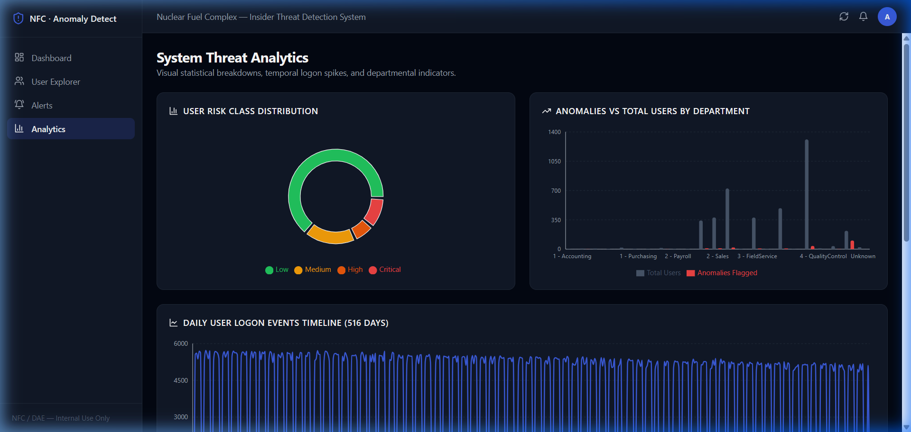

# Result Screenshot Guide — System Threat Analytics

This document describes the screenshot that should be placed here to demonstrate the interactive charts and statistical trends.

---

## 1. Screenshot Placeholder

> **Screenshot Filename**: `presentation/screenshots/analytics.png`
> Insert the screenshot below:
> 

---

## 2. Key Components Demonstrated in this Screenshot

1. **User Risk Class Distribution (Pie Chart)**:
   * Interactive Recharts donut plot showing the percentage breakdown of monitored users categorized into `Low`, `Medium`, `High`, and `Critical` risk bands.

2. **Anomalies vs Total Users by Department (Bar Chart)**:
   * Grouped bar chart comparing the total workforce count against the volume of flagged outliers within specific NFC divisions (e.g., Security, IT, Operations, Engineering).

3. **Daily User Logon Events Timeline (Line Chart)**:
   * Dynamic line chart detailing daily user logons across 500+ days, highlighting unexpected peaks and baseline anomalies.

4. **Daily USB Device Connect Events Timeline (Area Chart)**:
   * Purple-themed gradient area chart displaying USB mounting spikes, used by security analysts to correlate access spikes with potential bulk data staging events.

---

## 3. How to Capture this Screenshot

1. Open your browser and navigate to [http://localhost:5173/analytics](http://localhost:5173/analytics) (or click **Analytics** in the navigation sidebar).
2. Hover your cursor over one of the charts to trigger the Recharts interactive tooltip.
3. Capture a high-resolution screenshot of the browser window. Save it as `analytics.png` inside the `presentation/screenshots/` folder.
