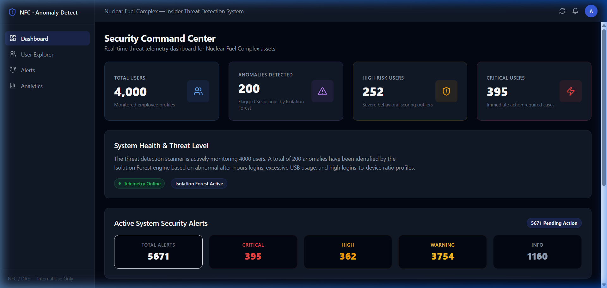

# Result Screenshot Guide — Security Command Center (Dashboard)

This document describes the screenshot that should be placed here to demonstrate the main dashboard interface.

---

## 1. Screenshot Placeholder

> **Screenshot Filename**: `presentation/screenshots/dashboard.png`
> Insert the screenshot below:
> 

---

## 2. Key Components Demonstrated in this Screenshot

1. **Security Summary Statistics Cards**:
   * **Total Users**: Total count of employee profiles monitored.
   * **Anomalies Detected**: Number of accounts flagged by the Isolation Forest model as `Suspicious`.
   * **High Risk Users**: Count of users with elevated risk scores (between 51 and 75).
   * **Critical Users**: Count of users requiring immediate lockout / security audits (risk score above 75).

2. **System Health Status indicators**:
   * Displays dynamic status badges (e.g., "Telemetry Online" and "Isolation Forest Active").

3. **Active Alerts Telemetry Panel**:
   * Breakdown of active alert counts across severity classes: `Total Alerts`, `Critical`, `High`, `Warning`, and `Info`.

4. **Report & Intelligence Export Center**:
   * Buttons to trigger PDF generation ("Export PDF Report") and download backend CSV logs (`final_security_profile.csv`, `anomaly_report.csv`, `risk_scores.csv`).

---

## 3. How to Capture this Screenshot

1. Run both the backend and frontend development servers.
2. Open your browser and navigate to [http://localhost:5173/](http://localhost:5173/).
3. In the navigation sidebar, click on **Dashboard** (or **Command Center**).
4. Take a clean capture of the full browser page. Save it as `dashboard.png` inside the `presentation/screenshots/` folder.
